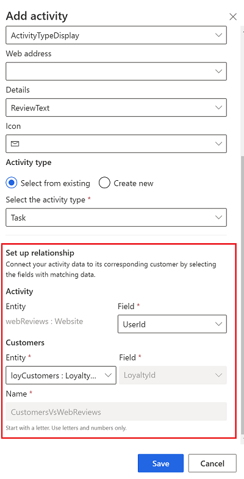

# Customer activities

Combine customer activities from [various data sources](data-sources.md) in Dynamics 365 Customer Insights to create a customer timeline that lists the activities in chronological order. You can include the timeline in customer engagement apps in Dynamics 365 via the [Customer Card add-in](customer-card-add-in.md), or in a Power BI dashboard.

This article covers the **Activities** page.

## Define an activity

Your data sources include entities with transactional and activity data from multiple data sources. Identify these entities and select the activities you want to view on the customer's timeline. Choose the entity that includes your target activity or activities.

1. In audience insights, go to **Data** > **Activities**.

1. Select **Add activity**.

   > [!NOTE]
   > An entity must have at least one attribute of type **Date** to be included in a customer timeline and you can't add entities without **Date** fields. The **Add activity** control is disabled if no such entity is found.

1. In the **Add activity** pane, set the values for the following fields:

   - **Entity**: Select an entity that includes transactional or activity data.
   - **Primary key**: Select the field that uniquely identifies a record. It shouldn't contain any duplicate values, empty values, or missing values.
   - **Timestamp**: Select the field that represents the start time of your activity.
   - **Event**: Select the field that is the event for the activity.
   - **Web address**: Select the field that represents a URL providing additional information about this activity. For example, the transactional system that sources this activity. This URL can be any field from the data source, or it can be constructed as a new field using a Power Query transformation. This URL data will be stored in the Unified Activity entity, which can be consumed downstream using APIs.
   - **Details**: Optionally, select the field that is added for additional details.
   - **Icon**: Optionally, select the icon that represents this activity.
   - **Activity Type**: Define the activity type reference to Common Data Model that best describes the semantic definition of the activity.

1. In the **Set up relationship** section, configure the details to connect your activity data to its corresponding customer.

   > [!div class="mx-imgBorder"]
   > 

    - **Activity entity field**: Select the field in your activity entity that will be used to establish a relationship with another entity.
    - **Customer entity**: Select the corresponding source customer entity with which your activity entity will be in relationship. You can relate to only those source customer entities that are used in the data unification process.
    - **Customer entity field**: This field shows the primary key of the source customer entity as selected in the map process. This primary key field in the source customer entity is used to establish a relationship with the activity entity.
    - **Name**: If a relationship between this activity entity and the selected source customer entity already exists, the relationship name will be in read-only mode. If there no such relationship exists, a new relationship will be created with the name provided here.

1. Select **Save** to apply your changes.

1. On the **Activities** page, select **Run**.

> [!TIP]
> There are [six types of status](system.md#status-types) for tasks/processes. Additionally, most processes [depend on other downstream processes](system.md#refresh-policies). You can select the status of a process to see details on the progress of the entire job. After selecting **See details** for one of the job's tasks, you find additional information: processing time, the last processing date, and all errors and warnings associated with the task.

## Edit an activity

1. In audience insights, go to **Data** > **Activities**.

2. Select the activity entity you want to edit and select **Edit**. Or, you can hover over the entity row and select the **Edit** icon.

3. Click on the **Edit** icon.

4. In the **Edit activity** pane, update the values and select **Save**.

5. On the **Activities** page, select **Run**.

## Delete an activity

1. In audience insights, go to **Data** > **Activities**.

2. Select the activity entity you want to remove and select **Delete**. Or, you can hover over the entity row and select the **Delete** icon. Additionally, you can select multiple activity entities to be deleted at once.
   > [!div class="mx-imgBorder"]
   > 

3. Select on the **Delete** icon.

4. Confirm your deletion.

## Next steps

You can review the [Customer Card add-in](customer-card-add-in.md) article to show activities in other apps. To build a Power BI dashboard, have a look at the [Power BI connector](export-power-bi.md) article.
