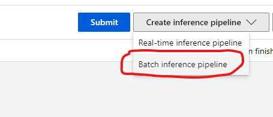
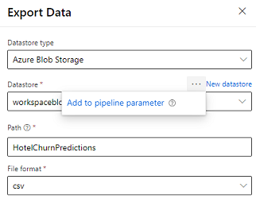

# Use Azure Machine Learning-based models

The unified data in Dynamics 365 Customer Insights is a source for building machine learning models that can generate additional business insights. Customer Insights integrates with Machine Learning Studio Classic and Azure Machine Learning to use your own custom models. Please refer to [Machine Learning Studio experiments](machine-learning-studio-classic-experiments.md) for examples of experiments built on Machine Learning Studio Classic. 

## Prerequisites

- Access to Customer Insights
- Active Azure Enterprise subscription
- [Unified customer profiles](data-unification.md)
- [Entity export to Azure Blob storage](export-azure-blob-storage.md) set up

## Set up Azure Machine Learning Workspace

1. Follow instructions here on the different ways to [create a Azure Machine Learning workspace](https://docs.microsoft.com/azure/machine-learning/concept-workspace#-create-a-workspace). For best performance, create the workspace in an **Azure region** that is geographically closest to your Customer Insights environment.

1. Access your workspace through the [Azure Machine Learning Studio](https://ml.azure.com/). There are several [different ways to interact](https://docs.microsoft.com/azure/machine-learning/concept-workspace#tools-for-workspace-interaction) with your workspace.

## Work with Azure Machine Learning Designer

Azure Machine Learning Designer provides a visual canvas where you can drag and drop datasets and modules, similar to Machine Learning Studio Classic. A batch pipeline created from the designer can be integrated into Customer Insights if they are configured appropriately. 

   * We will attempt to calculate Churn of patrons of a fictional Contoso Hotel. Please refer to the [Churn Analysis experiment](machine-learning-studio-classic-experiments.md#churn-analysis) for additional context.
   * This [walk through](hotel-churn-designer-walkthrough.md) has detailed steps to create the experiment using Azure Machine Learning Designer.
   
## Working with Azure Machine Learning SDK

Data scientists and AI developers use the [Azure Machine Learning SDK](https://docs.microsoft.com/python/api/overview/azure/ml/?view=azure-ml-py&preserve-view=true) to build machine learning workflows. Currently, models trained using the SDK can't be integrated directly with Customer Insights. A Batch inference pipeline that consumes that model is required for integration with Customer Insights.

## Batch pipeline requirements for Customer Insights Integration

### Dataset Configuration
You will need to create datasets to bring in entity data from Customer Insights to your Batch Inference pipeline. These datasets need to be registered in the workspace and currently we only support [Tabular datasets](https://docs.microsoft.com/azure/machine-learning/how-to-create-register-datasets#tabulardataset) in csv format. The datasets that correspond to entity data need to be parameterized as a Pipeline parameter.
   * Dataset parameters in Designer
   > [!div class="mx-imgBorder"]
   > 
   * Dataset parameter in SDK (Python)
   ```python
   HotelStayActivity_dataset = Dataset.get_by_name(ws, name='Hotel Stay Activity Data')
   HotelStayActivity_pipeline_param = PipelineParameter(name="HotelStayActivity_pipeline_param", default_value=HotelStayActivity_dataset)
   HotelStayActivity_ds_consumption = DatasetConsumptionConfig("HotelStayActivity_dataset", HotelStayActivity_pipeline_param)
   ```

### Batch Inference Pipeline
   * In the Designer experience, a training pipeline can be used to create or update an Inference pipeline. Currently, only Batch Inference pipelines are supported.
   > [!div class="mx-imgBorder"]
   > 

   * Using the SDK, you may publish the pipeline into an Endpoint. Currently, Customer insights will only integrate with the default pipeline in a Batch Pipeline Endpoint in the Azure Machine Learning workspace.
   ```python
   published_pipeline = pipeline.publish(name="ChurnInferencePipeline", description="Published Churn Inference pipeline")
   pipeline_endpoint = PipelineEndpoint.get(workspace=ws, name="ChurnPipelineEndpoint") 
   pipeline_endpoint.add_default(pipeline=published_pipeline)
   ```

### Importing data into Customer Insights
   * The designer provides the [Export Data Module](https://docs.microsoft.com/azure/machine-learning/algorithm-module-reference/export-data) that allows the output of an inference to be exported to Azure Storage. Currently, the module must use the Datastore type **Azure Blob Storage** and parameterize the **Datastore** and relative **Path** within the datastore to facilitate integration with Customer Insights.
   > [!div class="mx-imgBorder"]
   > 
   
   * When writing the inference output using code, you may upload the Output to the a path within a **registered datastore** in the workspace. If the path and datastore are parameterized in the pipeline, Customer insights will be able to read the output. Currently, tabular data in csv format is supported.
   ```python
   # In Pipeline setup script
      OutputPathParameter = PipelineParameter(name="output_path", default_value="HotelChurnOutput/")
      OutputDatastoreParameter = PipelineParameter(name="output_datastore", default_value="workspaceblobstore")
   ...
   # In pipeline execution script
      run = Run.get_context()
      ws = run.experiment.workspace
      datastore = Datastore.get(ws, output_datastore) # output_datastore is parameterized
      datastore.upload(src_dir=<<working directory>>, target_path=output_path, overwrite=False, show_progress=True) # output_path is parameterized.
   ```
