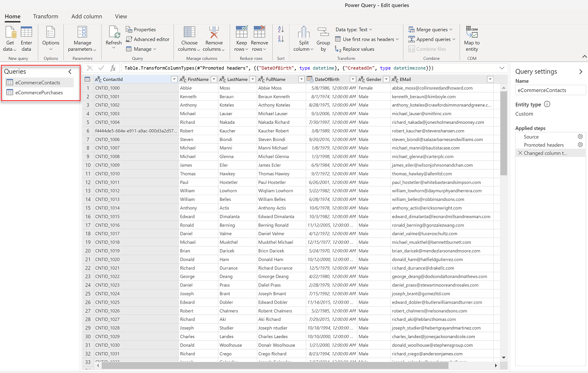
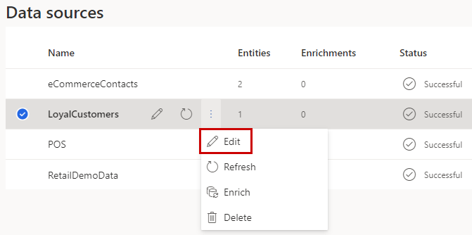

# Connect to a Power Query data source

Power Query offers a broad set of connectors to ingest data. Most of these connectors are supported by Dynamics 365 Customer Insights. Adding data sources based on Power Query connectors generally follows the steps outlined in the next section. However, depending on the connector you use, different information is required. For more information, see the documentation about individual connectors in the [Power Query connector reference](https://docs.microsoft.com/power-query/connectors/).

## Create a new data source

1. In audience insights, go to **Data** > **Data sources**.

1. Select **Add data source**.

1. Choose the **Import data** method and select **Next**.

1. Provide a **Name** for the data source, and select **Next** to create the data source.

1. Choose one of the [available connectors](#available-power-query-data-sources). For this example, we select the **Text/CSV** connector.

1. Enter the required details in the **Connection settings** for the selected connector and select **Next** to see a preview of the data.

1. Select **Transform data**. In this step, you'll add entities to your data source. Entities are datasets. If you have a database that includes multiple datasets, each dataset is its own entity.

1. The **Power Query - Edit queries** dialog lets you review and refine the data. The entities that the systems identified in your selected data source appear in the left pane.

   > [!div class="mx-imgBorder"]
   > 

1. You can also transform your data. Select an entity to edit or transform. Use the options in the Power Query window to apply transformations. Each transformation gets listed under **Applied steps**. Power Query provides numerous pre-built transformation options. For more information, see [Power Query Transformations](https://docs.microsoft.com/power-query/power-query-what-is-power-query#transformations).

1. You can add additional entities to your data source by selecting **Get data** in the **Edit queries** dialog.

   These transformations are highly recommended:

   - If you're ingesting data from a CSV file, the first row often contains headers. Go to **Transform table** and select **Use headers as first row**.
   - Ensure the data type is set appropriately.

1. Select **Save** at the bottom of the Power Query window to save the transformations. After saving, you'll find your data source on **Data** > **Data sources**.

1. On the **Data sources** page, you'll notice the new data source is in **Refreshing** status.

## Available Power Query data sources

See the [Power Query connector reference](https://docs.microsoft.com/power-query/connectors/) for an up-to-date list of connectors that you can select to import data to Customer Insights. 

Connectors with a checkmark in the **Customer Insights (Dataflows)** column are available to create new data sources based on Power Query. Review the documentation of a specific connector to learn more about its prerequisites, limitations, and other details.

## Edit Power Query data sources

> [!NOTE]
> It might not be possible to make changes to data sources that are currently being used in one of the app's processes (*segmentation*, *match*, or *merge*, for example). 
>
> Using the **Settings** page, you can track the progress of each of the active processes. When a process completes, you can return to the **Data Sources** page and make your changes.

1. In audience insights, go to **Data** > **Data sources**.

2. Select the vertical ellipsis next to the data source you want to change and select **Edit** from the drop-down menu.

   > [!div class="mx-imgBorder"]
   > 

3. Apply your changes and transformations in the **Power Query - Edit queries** dialog as described in the [Create a new data source](#create-a-new-data-source) section.

4. Select **Save** in Power Query after completing your edits to save your changes.
