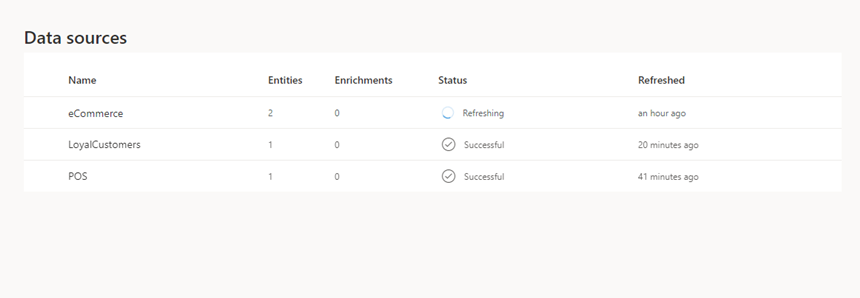

# Overview about data sources

The audience insights capability in Dynamics 365 Customer Insights connects to data from a broad set of sources. Connecting to a data source is often referred to as the process of *data ingestion*. After ingesting the data, you can [unify](data-unification.md) and take action on it.

## Add a data source

Refer to the detailed articles on how to add a data source, depending on which option you choose.

You can add a data source in three main ways:

- [Through dozens of Power Query connectors](connect-power-query.md)
- [From a Common Data Model folder](connect-common-data-model.md)
- [From your own Common Data Service lake](connect-common-data-service-lake.md)

> [!NOTE]
> You can't add data from on-premises data sources yet.

## Review ingested data

You'll see the name of each ingested data source, its status, and the last time the data was refreshed for that source. You can select any field to dort the list of data sources by that field values.

> [!div class="mx-imgBorder"]
> 

|Status  |Description  |
|---------|---------|
|Successful   |Data source was successfully ingested if a time interval is mentioned in the Refreshed field.
|Not started   |The data source has no data ingested yet or still in authoring/draft mode.         |
|Refreshing    |Data ingestion is in progress. You can cancel this operation by selecting **Stop refreshing** in the **Actions** column. Stopping the refresh of a data source will revert it to its last refresh state.       |
|Failed     |Data ingestion ran into errors.         |

Select the refresh status link to review more details on the refresh status, including any refresh failure details and downstream processes update.

Loading data can take some time. After a successful refresh, the ingested data can be reviewed from the **Entities** page. For more information, see [Entities](entities.md).

## Refresh a data source
Data sources can be refreshed on an automatic schedule or can be refreshed manually on an *ad hoc* basis. 

Use the **Admin** > **System** > [**Schedule** tab](https://docs.microsoft.com/en-us/dynamics365/customer-insights/audience-insights/system#schedule-tab) to schedule automatic refreshes of all your ingested data sources.

For *ad hoc* refresh of a data source, follow the below steps

1. In audience insights, go to **Data** > **Data sources**

2. Select the vertical ellipsis next to the data source you want to refresh and select **Refresh** from the drop-down menu.

3. You will see that the data source is now triggered for an *ad hoc* manual refresh. Refreshing a data source will update both the entity schema as well as data for all the entities specified in the data source.

4. Select **Stop refreshing** if you want to cancel an existing refresh and the data source will revert to its last refresh status.

## Delete a data source

1. In audience insights, go to **Data** > **Data sources**.

2. Select the vertical ellipsis next to the data source you want to remove and select **Delete** from the drop-down menu.

3. Confirm your deletion.
