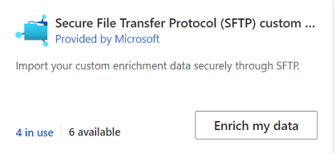
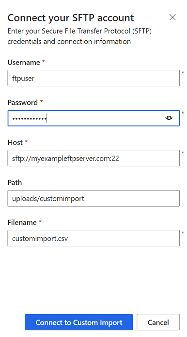

# Enrich customer profiles with custom data (preview)

Secure File Transfer Protocol(SFTP) custom import enables you to import data that doesn't have to go through the process of data unification. It's a flexible, secure, and easy way to bring in your data. SFTP custom import can be used in combination with [SFTP export](export-sftp.md) that lets you export the customer profile data that is needed for enrichment. The data can then be processed, enriched, and SFTP custom import can be used to bring the enriched data back to the audience insights capability of Dynamics 365 Customer Insights.

## Prerequisites

To configure SFTP custom import, the following prerequisites must be met:

- You have user credentials (user name and password) for the SFTP location where the data that is going to be imported from.
- You have the URL and port number (usually 22) for the STFP host.
- You have the filename and location of the file to be imported on the SFTP host.
- There's a *model.json* file that specifies the schema for the data that are to be imported. This file must be in the same directory as the file to import.
- You have [Administrator](permissions.md#administrator) permission.

## Configuration

1. Go to **Data** > **Enrichment** and select the **Discover** tab.

1. On the **SFTP custom import tile**, select **Enrich my data**.

   > [!div class="mx-imgBorder"]
   > 

1. Select **Get started** and provide the credentials and the address for the SFTP server. For example, sftp://mysftpserver.com:22.

1. Enter the name of the file that contains the data and path to the file on the SFTP server if it's not in the root folder.

1. Confirm all inputs by selecting **Connect to Custom Import**.

   > [!div class="mx-imgBorder"]
   > 

## Defining field mappings 

The directory that contains the file to be imported on the SFTP server must also contain a *model.json* file. This file defines the schema to use for importing the data. The schema has to use [the Common Data Model](https://docs.microsoft.com/common-data-model/) to specify the field mapping. A simple example of a model.json file looks like this:

```
{
	"name": "EnrichmentFromMicrosoft",
	"description": "Model containing data enrichment",
	"entities": [
		{
			"name": "CustomImport",
			"attributes": [
				{
					"name": "CustomerId",
					"friendlyName": "Client id",
					"dataType": "string"
				},
				{
					"name": "PreferredCity",
					"friendlyName": "Preferred City for vacation",
					"dataType": "string"
				},
				{
					"name": "PreferredTransportation",
					"friendlyName": "Preferred transportation",
					"dataType": "string"
				}
			],
			"annotations": [
				{
					"name": "c360:PrimaryKey",
					"value": "CustomerId"
				}
			]
		}
	],
	"modifiedTime": "2020-01-02T12:00:00+08:00",
	"annotations": [
		{
			"name": "testAnnotation",
			"value": "testValue"
		}
	]
}
```

## Enrichment results

To start the enrichment process, select **Run** from the command bar. You can also let the system run the enrichment automatically as part of a [scheduled refresh](system.md#schedule-tab). The processing time will depend on the size of the data to be imported and the connection to the SFTP server.

After the enrichment process completes, you can review your newly imported custom enrichment data under **My enrichments**. Additionally, you'll find the time of the last update and the number of enriched profiles.

You can access a detailed view of each enriched profile by selecting **View enriched data**.

## Next steps

Build on top of your enriched customer data. Create [segments](segments.md), [measures](measures.md), and [export the data](export-destinations.md) to deliver personalized experiences to your customers.


[!INCLUDE[footer-include](../includes/footer-banner.md)]