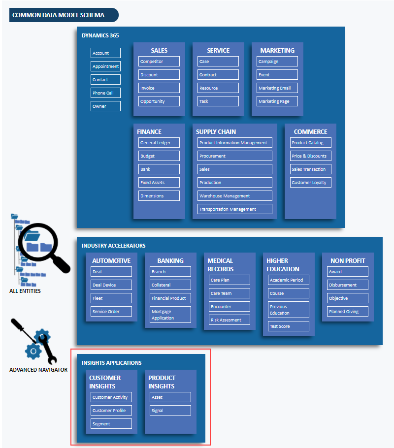

# Entity schemas in Common Data Model

[!INCLUDE [cc-data-platform-banner](../includes/cc-data-platform-banner.md)]

[Common Data Model](/common-data-model/) is a declarative specification, and a definition of standard entities that represent commonly used concepts and activities across business and productivity applications. This model is being extended to observational and analytical data as well. Common Data Model provides well-defined, modular, and extensible business entities—such as Account, Business Unit, Case, Contact, Lead, Opportunity, and Product—as well as interactions with vendors, workers, and customers—such as activities and service level agreements. Anyone can build on and extend Common Data Model definitions to capture additional business-specific ideas.

This shared data model allows applications and data integrators to collaborate more easily by providing a unified definition of data. Common Data Model includes a rich metadata system with standard entities, relationships, hierarchies, traits, and more. It originated from Dynamics 365 apps and is open-sourced on GitHub with over 260 standard entities. A large system of internal and external partners contributes industry-specific concepts to Common Data Model.

Multiple systems and platforms implement the Common Data Model today, including Power BI dataflows and Azure Data Services. It's already supported in Microsoft Dataverse, Dynamics 365, Power Apps, Power BI, and upcoming Azure data services, directly accruing value towards the [Open Data Initiative](https://www.microsoft.com/open-data-initiative).

## Customer Insights entity schemas

To establish a 360-degree view of the customer and make Customer Insights models available in Common Data Model for extensibility, we've published the following entity schemas:

| Entity | Description |
|---------|---------|
|[CustomerActivity](/common-data-model/schema/core/applicationcommon/foundationcommon/crmcommon/solutions/customerinsights/customeractivity) | An activity performed by a user that has observational value to the business. |
|[CustomerProfile](/common-data-model/schema/core/applicationcommon/foundationcommon/crmcommon/solutions/customerinsights/customerprofile) | A person or organization that either performed, or has the potential to engage in, business activities. |
|[MeasureDefinition](/common-data-model/schema/core/applicationcommon/foundationcommon/crmcommon/solutions/customerinsights/measuredefinition) | Definition of KPIs partitioned by zero or more dimensions (such as Monthly Active Users, Total Spend By Customer, Average Customer Acquisition Cost) |
|[Segment](/common-data-model/schema/core/applicationcommon/foundationcommon/crmcommon/solutions/customerinsights/segment) | Defines a group of members with common traits. |
|[SegmentMembership](/common-data-model/schema/core/applicationcommon/foundationcommon/crmcommon/solutions/customerinsights/segmentmembership) | Members participating in a given segment. |

For more information, see the documentation about the [Customer Insights entity schemas in Common Data Model](/common-data-model/schema/core/applicationcommon/foundationcommon/crmcommon/solutions/customerinsights/overview).

## View entities using the Common Data Model Entity Navigator

You can view entities in the [Common Data Model Entity Navigator](https://microsoft.github.io/CDM/). Select an entity from the Insights Application section to get the list of Customer Insights entities and their definitions.
> [!div class="mx-imgBorder"]
> 

[!INCLUDE[footer-include](../includes/footer-banner.md)]
