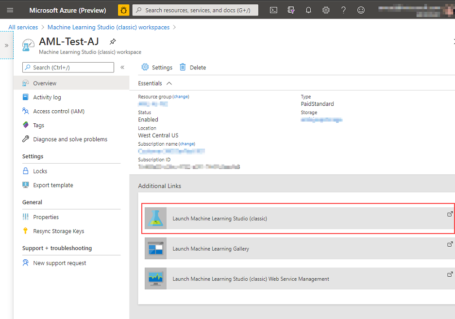
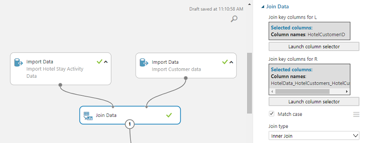
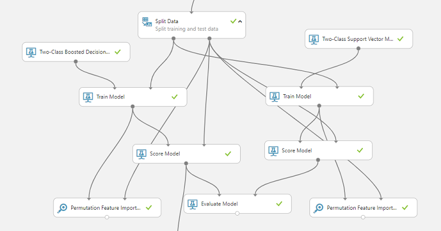
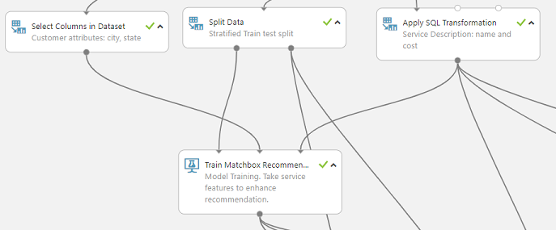
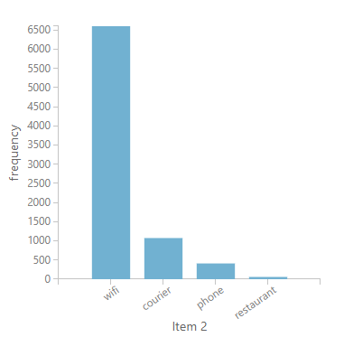

# Use models based on Azure Machine Learning Studio (classic)

The unified data in Dynamics 365 Customer Insights is a source for building machine learning models that can generate additional business insights. Customer Insights integrates with Machine Learning Studio (classic) to use your own custom models. To see how models developed in Azure Machine Learning are integrated with Customer Insights, see [Azure Machine Learning experiments](azure-machine-learning-experiments.md).

## Prerequisites

- Access to Customer Insights
- Active Azure Enterprise subscription
- [Unified customer profiles](data-unification.md)
- [Entity export to Azure Blob storage](export-azure-blob-storage.md) set up

## Set up Machine Learning Studio Classic

In a first step, we need to create a workspace for and open the Machine Learning Studio (classic).

1. Go to [https://www.portal.azure.com](https://www.portal.azure.com/) and sign in.

1. Select **Create a resource**.

1. Search **Machine Learning Studio Workspace** and select **Create**.

1. Enter the required details to [create the workspace](https://docs.microsoft.com/azure/machine-learning/studio/create-workspace). Choose the **Web service plan pricing tier** based on the amount of data you plan to import. For best performance, select the **Location** that is geographically closest to you.

1. After creating the resource, the Machine Learning Studio workspace dashboard will appear. Select **Launch Machine Learning Studio**.

   

## Work with Azure Machine Learning Studio

You can now create a new experiment, or import an existing experiment template from the sample gallery. There are sample experiments for three standard scenarios:

- [Churn prediction](#churn-analysis)

- [Customer lifetime value](#customer-lifetime-value-prediction)

- [Product recommendation or next best action](#productrecommendation-or-next-best-action)

1. If you create a new experiment or use an experiment template from the gallery, you need to configure the **Import Data** properties. Use the guided experience or directly provide details to access the Azure Blob Storage that contains your data.  

   

1. Now you can build a custom processing pipeline to clean and preprocess the data, extract features, and train a suitable model.

1. Test and optimize the model performance.

1. When you’re satisfied with the quality of a model, select **Set up web service** > **Predictive Web Service**. This option imports the trained model and the featurization pipeline from the training experiment to a predictive service. The predictive service can take another set of input data with the schema used in the training experiment to make predictions.

   

1. Once the predictive web service experiment is successful, you can deploy it for auto scheduling. To have the web service work with Customer Insights, select **Deploy Web Service** > **Deploy Web Service [New] Preview**. [Learn more about deploying a web service](https://docs.microsoft.com/azure/machine-learning/studio/deploy-a-machine-learning-web-service).

   

## Sample models from the gallery

We'll use a fictitious scenario of Contoso Hotel for the models in this article. Contoso Hotel gathers the following data:

- CRM data consisting of hotel stay activity. The data set includes information about the dates of stay for each registered customer. It also contains information about the booking, room types, details of spend, and so on. The data spans four years, from January 2014 to January 2018.
- Customer profiles of hotel guests. These profiles contain information about each customer, including their name, birthdate, postal address, gender, and phone number.
- Usage of services offered by the hotel, such as the spa, laundry, WiFi, or courier. This information is logged for each registered customer. Typically, use of services is linked with the stay. In some cases, services can be used by customers without staying in the hotel.

## Churn Analysis

Churn analysis applies to different business areas. In this example, we’re going to look at service churn, specifically in the context of hotel services as described above. It provides a working example of an end–to–end model pipeline that can be used as a starting point for any other type of churn model.

### Definition of Churn

The definition of churn can differ based on the scenario. In this example, a guest who hasn’t visited the hotel in the past year should be labeled as churned.  

The experiment template can be imported from the gallery. First, ensure that you import the data for **Hotel Stay Activity**, **Customer data**, and **Service Usage Data** from Azure Blob storage.

   

### Featurization

Based on the definition of churn, we first identify the raw features that will influence the label. Then, we process these raw features into numerical features that can be used with machine learning models. Data integration happens in Customer Insights so we can join these tables by using the *Customer ID*.

   

The featurization for building the model for churn analysis can be a little tricky. The data is a function of time with new hotel activity recorded on daily basis. During featurization, we want to generate static features from the dynamic data. In this case, we generate multiple features from hotel activity with a sliding window of one year. We also expand the categorical features like room type or booking type into separate features using one-hot encoding.  

Final list of features:

| **Number**  | **Original_Column**          | **Derived Features**                                                                                                                      |
|-------------|------------------------------|-------------------------------------------------------------------------------------------------------------------------------------------|
| 1           | Room Type                    | RoomTypeLargeCount, RoomTypeSmallCount                                                                                                    |
| 2           | Booking Type                 | BookingTypeOnlineCount, BookingTypePhoneCallCount                                                                                         |
| 3           | Travel Category              | TravelCategoryBusinessCount, TravelCategoryLeisureCount                                                                                   |
| 4           | Dollars Spent                | TotalDollarSpent                                                                                                                          |
| 5           | Check-in and Checkout dates  | StayDayCount, StayDayCount2016, StayDayCount2015, StayDayCount2014, StayCount, StayCount2016. StayCount2015, StayCount2014                |
| 6           | Service Usage                | UsageTenure, ConciergeUsage, CourierUsage, DryCleaningUsage, GymUsage, PhoneUsage, RestaurantUsage, SpaUsage, TelevisionUsage, WifiUsage  |

### Model selection

Now we need to choose the optimal algorithm to use. In this case, most features are based on categorical features. Typically, decision tree–based models work well. If there are only numerical features, neural networks could be a better choice. Support vector machine (SVM) also is a good candidate in such situations; however, it needs quite a bit of tuning to extract the best performance. We choose **Two-Class Boosted Decision Tree** as the first model of choice followed by **Two-Class SVM** as the second model. Azure Machine Learning Studio lets you do A/B testing, so it’s beneficial to start with two models rather than one.

The following image shows the model training and evaluation pipeline from Azure Machine Learning Studio:

We also apply a technique called **Permutation Feature Importance**, an important aspect of model optimization. Built-in models have little to no insight into the impact of any specific feature on the final prediction. The feature importance calculator uses a custom algorithm to compute the influence of individual features on the outcome for a specific model. The feature importance is normalized between +1 to -1. A negative influence means the corresponding feature has counter-intuitive influence on the outcome and should be removed from the model. A positive influence indicates the feature is contributing heavily towards the prediction. These values aren't correlation coefficients as they are different metrics. For more information, see [Permutation Feature Importance](https://docs.microsoft.com/azure/machine-learning/studio-module-reference/permutation-feature-importance).

The entire [churn experiment is available in the Azure AI Gallery](https://gallery.azure.ai/Experiment/Hotel-Churn-Predictive-Exp).

## Customer lifetime value prediction

The customer lifetime value (CLTV) calculation is one of the key metrics that a business can use to assess and segment its customers. For the hotel business, it’s critical to know their customers. For example, understanding factors that make up good customers is crucial information. It helps the hotel management assess which features they need to focus on and improve to satisfy their high paying customers. These decisions can have a direct impact on sales and earnings.  

### Definition of CLTV

For this example, we define the CLTV of a customer as the total dollar amount the customer is expected to spend in the next 365 days. We are going to use the past three years’ worth of data for all customers to predict this value.

### Featurization

In this case, featurization is going to be quite like the churn scenario. However, the labels and predicted values are different than defined above.

### Model selection

Predicting the CLTV is a regression problem as the predicted value is a positive valued continuous variable. Based on the feature properties, we select **Boosted Decision Tree Regression** as one algorithm and **Neural Network Regression** as another algorithm to train the model.

## Product recommendation or Next Best Action

Product recommendation in a hotel scenario is interpreted as recommending services offered by the hotel to the customers. The objective is to choose the appropriate services for customers so that their usage is maximized. It’s similar to movie recommendations for video streaming service users.

### Definition of Product Recommendation or Next Best Action

We define the goal as maximizing the dollar amount of service usage by offering the best matching services to hotel customers according to their interest.

### Featurization

Like the churn model, we are joining the hotel ServiceCustomerID with CustomerID in order to build recommendations consistently per CustomerID.

The data is sourced from three different entities and features are derived from them. The featurization for the problem of recommendation is different compared to churn or CLTV scenarios. The recommendation model needs input data in the form of three sets of features.

### Model selection

We predict products or services by using the algorithm called **Train Matchbox Recommender** to train the recommendation model.

The three input ports for the **Train Matchbox Recommender** model takes in the training service usage data, customer description (optional), and service description. There are three different ways of scoring the model. One is for model evaluation where a Normalized Discounted Cumulative Gain (NDCG) score is calculated to rank the rated items. In this experiment, we have the NDCG score as 0.97. The other two options are scoring the model on the entire recommendable service catalog, or scoring only on items that users have not used before.

Looking further on the distributions of the recommendations on the entire service catalog, we notice that phone, WiFi, and courier are the top services to be recommended. This is consistent with what we found from the distributions of the service consumption data:

The entire [product recommendation experiment can be accessed in Azure AI Gallery.](https://gallery.azure.ai/Experiment/Recommendation-4)

## Integrate custom models

To use these predictions in Customer Insights, you need to **export** the predictions along with the customer IDs. [Export them to the same Azure Blob storage location](https://docs.microsoft.com/azure/storage/common/storage-import-export-data-from-blobs) that you export the source data to. The predictive web service can be scheduled to run regularly and update the scores.

Data generated by the custom model can be used to further enrich your customer data. For more information, see [Custom machine learning models](custom-models.md).
