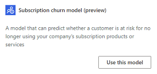
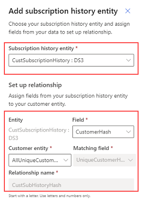
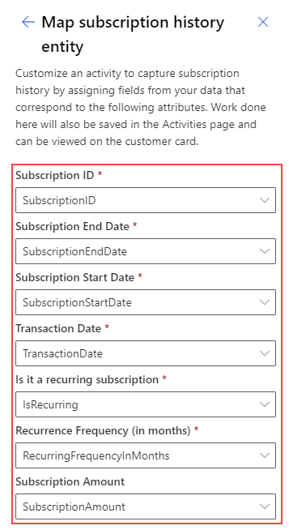
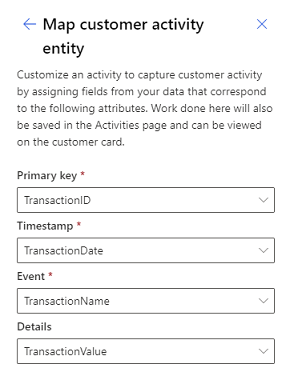
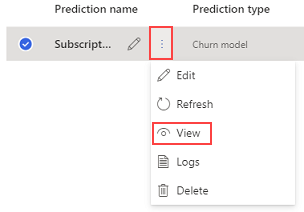
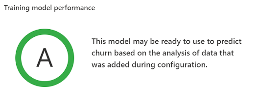
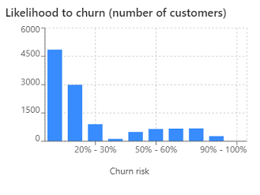

# Subscription churn prediction (preview)

Subscription churn prediction helps predicting whether a customer is at risk for no longer using your company’s subscription products or services. You can create new subscription churn prediction on the **Intelligence** > **Predictions** page. Select **My predictions** to see other predictions that you've created.

> [!VIDEO https://www.microsoft.com/en-us/videoplayer/embed/RWOKNQ]

> [!TIP]
> Try the tutorial for a subscription churn prediction using sample data: [Subscription churn prediction sample guide](sample-guide-predict-subscription-churn.md).

## Prerequisites

- At least [Contributor permissions](permissions.md).
- Business knowledge to understand what churn means for your business. We support time-based churn definitions, meaning a customer is considered to have churned a period of time after their subscription is ended.
- Data about your subscriptions and their history:
    - Subscription identifiers to distinguish subscriptions.
    - Customer identifiers to match subscriptions to your customers.
    - Subscription event dates, which define start dates, end dates, and the dates the subscription events occurred on.
    - Subscription information to define if it's a recurring subscription and how often it renews.
    - The semantic data schema for subscriptions requires the following information:
        - **Subscription ID:** A unique identifier of a subscription.
        - **Subscription End Date:** The date the subscription expires for the customer.
        - **Subscription Start Date:** The date the subscription starts for the customer.
        - **Transaction Date:** The date a subscription change happened. For example, a customer buying or canceling a subscription.
        - **Is it a recurring subscription:** A boolean true/false field that determines if the subscription will renew with the same subscription ID without customer intervention
        - **Recurrence Frequency (in months):** For recurring subscriptions, it's the period the subscription will renew for. It's represented in months. For example, a yearly subscription that automatically renews for a customer every year for another year has the value 12.
        - (Optional) **Subscription Amount:** The amount of currency a customer pays for the subscription renewal. It can help identify patterns for different levels of subscriptions.
- Data about customer activities:
    - Activity identifiers to distinguish activities of the same type.
    - Customer identifiers to map activities to your customers.
    - Activity information containing the name and date of the activity.
    - The semantic data schema for customer activities includes:
        - **Primary key:** A unique identifier for an activity. For example, a website visit or a usage record showing the customer viewed a TV show episode.
        - **Timestamp:** The date and time of the event identified by the primary key.
        - **Event:** The name of the event you want to use. For example, a field called "UserAction" in a streaming video service could have the value of "Viewed".
        - **Details:** Detailed information about the event. For example, a field called "ShowTitle" in a streaming video service could have the value of a video a customer watched.
- Suggested data characteristics:
    - Sufficient historical data: Subscription data for at least double the selected time window. Preferably, two to three years of subscription data.
    - Subscription status: Data includes active and inactive subscriptions for each customer so there are multiple entries per customer ID.
    - Number of customers: At least 10 customer profiles, preferably more than 1,000 unique customers. The model will fail with fewer than 10 customers and insufficient historical data.
    - Data completeness: Less than 20% of missing values in the data field of the entity provided.
   
   > [!NOTE]
   > You'll need at least two activity records for 50% of the customers you want to calculate churn for.

## Create a subscription churn prediction

1. In audience insights, go to **Intelligence** > **Predictions**.
1. Select the **Subscription churn model (preview)** tile and select **Use this model**.
   > [!div class="mx-imgBorder"]
   > 

### Name model

1. Provide a name for the model to distinguish it from other models.
1. Provide a name for the output entity using letters and numbers only, without any spaces. That's the name that the model entity will use. Then, select **Next**.

### Define customer churn

1. Enter the number of **Days since subscription ended** that your business considers a customer to be in a churned state. This period is typically liked to business activities like offers or other marketing efforts trying to prevent losing the customer.
1. Enter the number of **Days to look into future to predict churn** to set a window to predict churn for. For example, to predict the risk of churn for your customers over the next 90 days to align to your marketing retention efforts. Predicting churn risk for longer or shorter periods of time can make it more difficult to address the factors in your churn risk profile, depending on your specific business requirements. Select **Next** to continue
   >[!TIP]
   > You can select **Save and close** at any time to save the prediction as a draft. You'll find the draft prediction in the **My predictions** tab to continue.

### Add required data

1. Select **Add data** for **Subscription history** and choose the entity that provides the subscription history information as described in the [prerequisites](#prerequisites).
1. If the fields below aren't populated, configure the relationship from your subscription history entity to the Customer entity.
    1. Select the **Subscription history entity**.
    1. Select the **Field** that identifies the customer in the subscription history entity. It needs to relate to the primary customer ID of your Customer entity.
    1. Select the **Customer entity** that matches your primary customer entity.
    1. Enter a name that describes the relationship.
       > [!div class="mx-imgBorder"]
       > 
1. Select **Next**.
1. Map the semantic fields to attributes within your subscription history entity and select **Save**. For descriptions of the fields, have a look at the [prerequisites](#prerequisites).
   > [!div class="mx-imgBorder"]
   > 
1. Select **Add data** for **Customer activities** and choose the entity that provides the customer activity information as described in the prerequisites.
1. Select an activity type that matches to the type of customer activity you're configuring.  Select **Create new** and provide a name if you don't see an option that matches the activity type you need.
1. You'll need to configure the relationship from your customer activity entity to the Customer entity.
    1. Select the field that identifies the customer in the customer activity table, which can be directly related to the primary customer ID of your Customer entity.
    1. Select the Customer entity that matches your primary Customer entity
    1. Enter a name that describes the relationship.
1. Select **Next**.
1. Map the semantic fields to attributes within your customer activity entity and select **Save**. For descriptions of the fields, have a look at the [prerequisites](#prerequisites).
1. (Optional) If you have any other customer activities you would like to include, repeat the steps above.
   > [!div class="mx-imgBorder"]
   > 
1. Select **Next**.

### Set schedule and review configuration

1. Set a frequency to retrain your model. This setting is important to update the accuracy of predictions as new data is ingested in audience insights. Most businesses can retrain once per month and get a good accuracy for their prediction.
1. Select **Next**.
1. Review the configuration. You can go back to any part of the prediction configuration by selecting **Edit** under the shown value. Or you can select a configuration step from the progress indicator.
1. If all values are configured correctly, select **Save and run** to begin the prediction process. On the **My predictions** tab, you can see the status of your predictions. The process may take several hours to complete depending on the amount of data used in the prediction.

## Review a prediction status and results

1. Go to the **My predictions** tab on **Intelligence** > **Predictions**.
   > [!div class="mx-imgBorder"]
   > 
1. Select the prediction you want to review.
   - **Prediction name:** The name of the prediction provided when creating it.
   - **Prediction type:** The type of model used for the prediction
   - **Output entity:** Name of the entity to store the output of the prediction. You can find an entity with this name on **Data** > **Entities**.    
     In the output entity, *ChurnScore* is the predicted probability of churn and *IsChurn* is a binary label based on *ChurnScore* with 0.5 threshold. The default threshold might not work for your scenario. [Create a new segment](segments.md#create-a-new-segment) with your preferred threshold.
   - **Predicted field:** This field is populated only for some types of predictions, and isn't used in subscription churn prediction.
   - **Status:** The current status of the prediction's run.
        - **Queued:** The prediction is currently waiting for other processes to run.
        - **Refreshing:** The prediction is currently running the "score" stage of processing to produce results that will flow into the output entity.
        - **Failed:** the prediction has failed. Select **Logs** for more details.
        - **Succeeded:** the prediction has succeeded. Select **View** under the vertical ellipses to review the prediction
   - **Edited:** The date the configuration for the prediction was changed.
   - **Last refreshed:** The date the prediction refreshed results in the output entity.
1. Select the vertical ellipses next to the prediction you want to review results for and select **View**.
   > [!div class="mx-imgBorder"]
   > 
1. There are three primary sections of data within the results page:
    1. **Training model performance:** A, B, or C are possible scores. This score indicates the performance of the prediction, and can help you make the decision to use the results stored in the output entity.
        - Scores are determined based on the following rules:
            - **A** when the model accurately predicted at least 50% of the total predictions, and when the percentage of accurate predictions for customers who churned is greater than the historical average churn rate by at least 10% of the historical average churn rate.
            - **B** when the model accurately predicted at least 50% of the total predictions, and when the percentage of accurate predictions for customers who churned is up to 10% greater than the historical average churn rate of the historical average churn rate.
            - **C** when the model accurately predicted less 50% of the total predictions, or when the percentage of accurate predictions for customers who churned is less than the historical average churn rate.
               > [!div class="mx-imgBorder"]
               > 
    1. **Likelihood to churn (number of customers):** Groups of customers based on their predicted risk of churn. This data can help you later if you want to create a segment of customers with high churn risk. Such segments help to understand where your cutoff should be for segment membership.
       > [!div class="mx-imgBorder"]
       > 
    1. **Most influential factors:** There are many factors that are taken into account when creating your prediction. Each of the factors has their importance calculated for the aggregated predictions a model creates. You can use these factors to help validate your prediction results. Or you can use this information later to [create segments](segments.md) that could help influence churn risk for customers.
       > [!div class="mx-imgBorder"]
       > 

## Manage predictions

It's possible to optimize, troubleshoot, refresh, or delete predictions. Review an input data usability report to find out how to make a prediction faster and more reliable. For more information, see [Manage predictions](manage-predictions.md).

[!INCLUDE[footer-include](../includes/footer-banner.md)]
