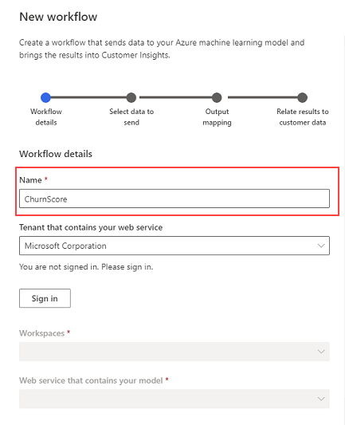
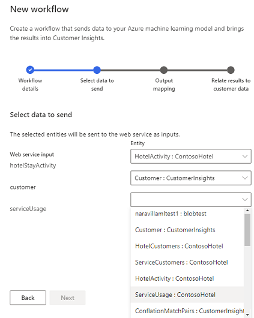
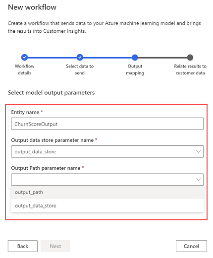
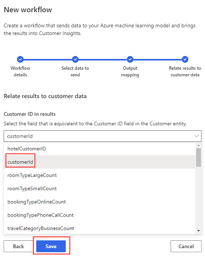

# Custom machine learning models

> [!NOTE]
> Support for Machine Learning Studio (classic) will end on 31 August 2024. We recommend you transition to [Azure Machine Learning](/azure/machine-learning/overview-what-is-azure-machine-learning) by that date.
>
> Beginning 1 December 2021, you will not be able to create new Machine Learning Studio (classic) resources. Through 31 August 2024, you can continue to use the existing Machine Learning Studio (classic) resources. For more information, see [Migrate to Azure Machine Learning](/azure/machine-learning/migrate-overview).

**Intelligence** > **Custom models** lets you manage workflows based on Azure Machine Learning models. Workflows help you choose the data you want to generate insights from and map the results to your unified customer data. For more information about building custom ML models, see [Use Azure Machine Learning-based models](azure-machine-learning-experiments.md).

## Responsible AI

Predictions offer capabilities to create better customer experiences, improve business capabilities, and revenue streams. We strongly recommend you balance the value of your prediction against the impact it has and biases that may be introduced in an ethical manner. Learn more about how Microsoft is [addressing Responsible AI](https://www.microsoft.com/ai/responsible-ai?activetab=pivot1%3aprimaryr6). You can also learn about [techniques and processes for responsible machine learning](/azure/machine-learning/concept-responsible-ml) specific to Azure Machine Learning.

## Prerequisites

- This feature supports web services published through [Azure Machine Learning batch pipelines](/azure/machine-learning/concept-ml-pipelines).

- You need an Azure Data Lake Gen2 storage account associated with your Azure Studio instance to use this feature. For more information, see [Create an Azure Data Lake Storage Gen2 storage account](/azure/storage/blobs/data-lake-storage-quickstart-create-account).

- For Azure Machine Learning workspaces with pipelines, you need Owner or User Access Administrator permissions to the Azure Machine Learning Workspace.

   > [!NOTE]
   > Data is transferred between your Customer Insights instances and the selected Azure web services or pipelines in the workflow. When you transfer data to an Azure service, please ensure that service is configured to process data in the manner and location necessary to comply with any legal or regulatory requirements for that data for your organization.

> [!VIDEO https://www.microsoft.com/en-us/videoplayer/embed/RWRElk]

## Add a new workflow

1. Go to **Intelligence** > **Custom models** and select **New workflow**.

1. Give your custom model a recognizable name in the **Name** field.

   > [!div class="mx-imgBorder"]
   > 

1. Select the organization that contains the web service in **Tenant that contains your web service**.

1. If your Azure Machine Learning subscription is in a different tenant than Customer Insights, select **Sign in** with your credentials for the selected organization.

1. Select the **Workspaces** associated with your web service. 

1. Choose the Azure Machine Learning pipeline in the **Web service that contains your model** dropdown. Then, select **Next**.    
   Learn more about [publishing a pipeline in Azure Machine Learning using the designer](/azure/machine-learning/concept-ml-pipelines#building-pipelines-with-the-designer) or [SDK](/azure/machine-learning/concept-ml-pipelines#building-pipelines-with-the-python-sdk). Your pipeline must be published under a [pipeline endpoint](/azure/machine-learning/how-to-run-batch-predictions-designer#submit-a-pipeline-run).

1. For each **Web service input**, select the matching **Entity** from Customer Insights and select **Next**.
   > [!NOTE]
   > The custom model workflow will apply heuristics to map the web service input fields to the entity attributes based on the name and data type of the field. You'll see an error if a web service field can't be mapped to an entity.

   > [!div class="mx-imgBorder"]
   > 

1. In the **Model Output Parameters** step, set the following properties:
      1. Enter the output **Entity name** you want pipeline output results to flow into.
      1. Select the **Output data store parameter name** of your batch pipeline from the dropdown.
      1. Select the **Output Path parameter name** of your batch pipeline from the dropdown.

      > [!div class="mx-imgBorder"]
      > 

1. Select the matching attribute from the **Customer ID in results** dropdown list that identifies customers and select **Save**.

   > [!div class="mx-imgBorder"]
   > 

1. You'll see the **Workflow Saved** screen with details about the workflow.    
   If you configured a workflow for an Azure Machine Learning pipeline, Customer Insights attaches to the workspace that contains the pipeline. Customer Insights will get a **Contributor** role on the Azure workspace.

1. Select **Done**.

1. You can now run the workflow from the **Custom Models** page.

## Edit a workflow

1. On the **Custom Models** page, select the vertical ellipsis (&vellip;) in the **Actions** column next to a workflow you've previously created and select **Edit**.

1. You can update your workflow's recognizable name in the **Display name** field, but you can't change the configured web service or pipeline. Select **Next**.

1. For each **Web service input**, you can update the matching **Entity** from Customer Insights. Then, select **Next**.

1. In the **Model Output Parameters** step, set the following properties:
      1. Enter the output **Entity name** you want pipeline output results to flow into.
      1. Select the **Output data store parameter name** for your test pipeline.
      1. Select the **Output Path parameter name** for your test pipeline.

1. Select the matching attribute from the **Customer ID in results** dropdown list that identifies customers and select **Save**.
   Choose an attribute from the inference output with values similar to the Customer ID column of the Customer entity. If don't have such a column in your data set, choose an attribute that uniquely identifies the row.

## Run a workflow

1. On the **Custom Models** page, select the vertical ellipsis (&vellip;) in the **Actions** column next to a workflow you've previously created.

1. Select **Run**.

Your workflow also runs automatically with every scheduled refresh. Learn more about [setting up scheduled refreshes](schedule-refresh.md).

## Delete a workflow

1. On the **Custom Models** page, select the vertical ellipsis (&vellip;) in the **Actions** column next to a workflow you've previously created.

1. Select **Delete** and confirm your deletion.

Your workflow will be deleted. The [entity](entities.md) that was created when you created the workflow persists, and can be viewed from the **Entities** page.

## Results

Results from a workflow are stored in the entity configured during the Model Output Parameter phase. You can access this data from the [entities page](entities.md) or with [API access](apis.md).

### API Access

For the specific OData query to get data from a custom model entity, use the following format:

`https://api.ci.ai.dynamics.com/v1/instances/<your instance id>/data/<custom model output entity name>%3Ffilter%3DCustomerId%20eq%20'<guid value>'`

1. Replace `<your instance id>` with the ID of your Customer Insights environment, which you find in the in the address bar of your browser when accessing Customer Insights.

1. Replace `<custom model output entity>` with the entity name you provided during the Model Output Parameters step of the custom model configuration.

1. Replace `<guid value>` with the Customer ID of the customer you'd like to access the record for. You can usually find this ID on the [customer profiles page](customer-profiles.md) in the CustomerID field.

## Frequently Asked Questions

- Why can't I see my pipeline when setting up a custom model workflow?    
  This issue is frequently caused by a configuration issue in the pipeline. Ensure the [input parameter is configured](azure-machine-learning-experiments.md#dataset-configuration), and the [output datastore and path parameters](azure-machine-learning-experiments.md#import-pipeline-data-into-customer-insights) are also configured.

- What does the error "Couldn't save intelligence workflow" mean?    
  Users usually see this error message if they don't have Owner or User Access Administrator privileges on the workspace. The user needs a higher level of permissions to enable Customer Insights to process the workflow as a service rather than using the user credentials for subsequent runs of the workflow.

[!INCLUDE [footer-include](includes/footer-banner.md)]
