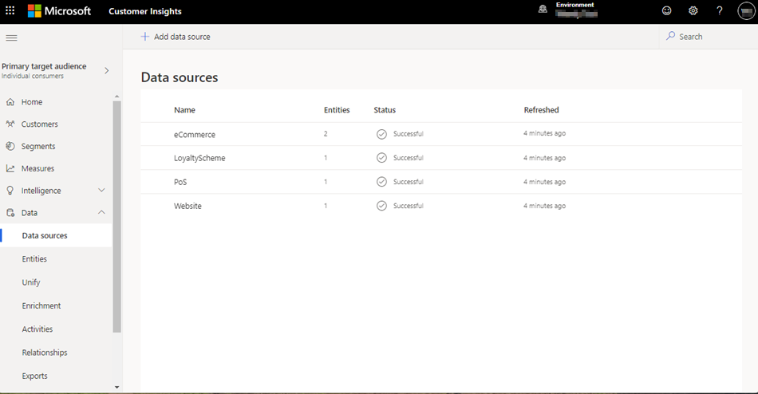

# Data Subject Rights (DSR) requests under GDPR

The European Union’s General Data Protection Regulation (GDPR) has been in effect since May 25, 2018. It gives significant rights to individuals regarding their data. The GDPR is about protecting and enabling the privacy rights of individuals. You can read more about Microsoft's commitment to security and compliance at the [Microsoft Trust Center](https://www.microsoft.com/trust-center).

We're committed to helping our customers meet their GDPR requirements. It includes the right to delete and export data that includes personal information such as user IDs, phone numbers, and email addresses. Administrators can implement user requests to delete or export personal data.

## Dynamics 365 Customer Insights

### Responding to GDPR data subject delete requests for Dynamics 365 Customer Insights

The “right to erasure” by the removal of personal data from an organization’s customer data is a key protection in the General Data Protection Regulation (GDPR). Removing personal data includes removing all personal data and system-generated logs, except audit log information.

#### Manage data subject delete requests

Customer Insights offers the following in-product experiences to delete personal data for a specific customer or user:

- **Manage delete requests for customer data**: Customer data in Customer Insights is ingested from original data sources external to Customer Insights. All GDPR delete requests must be performed in the original data source.
- **Manage delete requests for Customer Insights user data**: Data for users is created by Customer Insights. All GDPR delete requests must be performed in Customer Insights.

##### Manage requests to delete customer data

A Customer Insights admin can follow these steps to remove customer data that was deleted in the data source:

1. Sign in to Dynamics 365 Customer Insights.
2. Go to **Data** > **Data sources**
3. For each data source in the list that contains deleted customer data:
   1. Select the vertical ellipsis (&vellip;) and then select **Refresh**.
   2. Check the status of the data source under **Status**. A check mark means the refresh was successful. A warning triangle means something went wrong. If a warning triangle is displayed, contact D365CI@microsoft.com.

> [!div class="mx-imgBorder"]
> 

##### Manage delete requests for user data

A Customer Insights admin can follow these steps to delete Customer Insights user data:

1. Sign in to Dynamics 365 Customer Insights.
2. Go to **Admin** > **Security** > **Permissions**.
3. Select the check box for the user you want to delete.
4. Select **Remove**.

### Responding to GDPR data subject export requests

As part of our commitment to partner with you on your journey to the General Data Protection Regulation (GDPR), we’ve developed documentation to help you respond to requests from data subjects.

#### Manage export and view requests

The right of data portability allows data subjects to request a copy of their personal data in an electronic format (a “structured, commonly used, machine readable, and interoperable format”) that can be transmitted to another data controller.

##### Export customer data (tenant admin)

A tenant administrator can follow these steps to export data:

1. Send an email to D365CI@microsoft.com specifying the customer’s email address in the request. The Customer Insights team will send an email to the registered tenant admin email address, asking for confirmation to export data.
2. Acknowledge the confirmation to export the data for the requested customer.
3. Receive the exported data through the tenant admin email address.

##### Export user data (tenant admin)

1. Send an email to D365CI@microsoft.com specifying the user’s email address in the request. The Customer Insights team will send an email to the registered tenant admin email address, asking for confirmation to export data.
2. Acknowledge the confirmation to export the data for the requested user.
3. Receive the exported data through the tenant admin email address.

## Consent management (preview)

The consent management capability doesn't collect user data directly. It only imports and processes consent data that is provided by users in other applications.

To remove consent data about specific users, remove it in the data sources ingested to the consent management capability. After refreshing the data source, the removed data will be deleted in the Consent Center too. Applications that use the consent entity will also delete data that was removed on the source after a [refresh](system.md#refresh-processes). We recommend refreshing data sources quickly after responding to a data subject request to remove the user's data from all other processes and applications.

[!INCLUDE [footer-include](includes/footer-banner.md)]