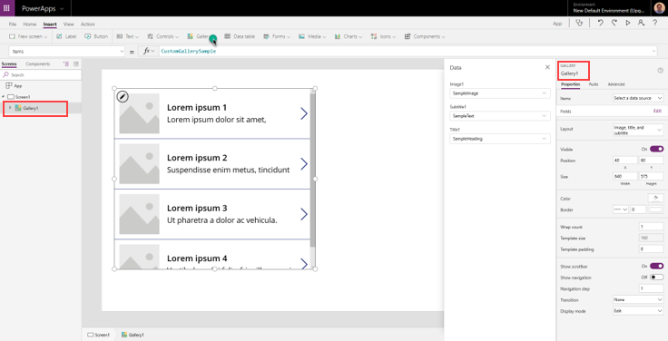

# Microsoft Power Apps connector (preview)

Bring unified customer profiles into your personalized apps with Power Apps.

## Connect Power Apps and Dynamics 365 Customer Insights

Customer Insights is one of the many [available sources for data in Power Apps](/powerapps/maker/canvas-apps/working-with-data-sources).

Refer to the Power Apps documentation to learn how to [add a data connection to an app](/powerapps/maker/canvas-apps/add-data-connection). We recommend you also review [how Power Apps uses delegation to handle large datasets in Canvas apps](/powerapps/maker/canvas-apps/delegation-overview).

## Available entities

After adding Customer Insights as a data connection, you can choose the following entities in Power Apps:

- **Customer**: to use data from the [unified customer profile](customer-profiles.md).
- **UnifiedActivity**: to display the [activity timeline](activities.md) in the app.
- **ContactProfile**: to display the contacts of a customer. This entity is only available in Customer Insights environments for business accounts.

## Limitations

### Retrievable entities

You can only retrieve the **Customer**, **UnifiedActivity**, **Segments**, and **ContactProfile** entities through the Power Apps connector. ContactProfile is only available in Customer Insights instance for business accounts. Other entities are shown because the underlying connector supports them through triggers in Power Automate.

You can do a maximum of 100 calls per 60 seconds. You can call the API endpoint multiple times by using the $skip parameter. [Learn more about the $skip parameter](/connectors/customerinsights/#get-items-from-an-entity).

### Delegation

Delegation works for the **Customer** entity and **UnifiedActivity** entity. 

- Delegation for **Customer** entity: To use delegation for this entity, the fields need to be indexed in [Search & filter index](search-filter-index.md).  
- Delegation for **UnifiedActivity**: Delegation for this entity only works for the fields **ActivityId** and **CustomerId**.  
- Delegation for **ContactProfile**: Delegation for this entity only works for the fields **ContactId** and **CustomerId**. ContactProfile is only available in Customer Insights environments for business accounts.

For more information about delegation, go to [Power Apps delegable functions and operations](/powerapps/maker/canvas-apps/delegation-overview). 

## Example gallery control

You can add customer profiles to a [gallery control](/powerapps/maker/canvas-apps/add-gallery).

1. Add a **gallery** control to an app you're building.

    > [!div class="mx-imgBorder"]
    > 

2. Select **Customer** as the data source for items.

    > [!div class="mx-imgBorder"]
    > 

3. You can change the data panel on the right to select which field for the Customer entity to show on the gallery.

4. If you want to show any field from the selected customer on the gallery, fill in the **Text** property of a label using **{Name_of_the_gallery}.Selected.{property_name}**  
    - For example: _Gallery1.Selected.address1_city_

5. To display the unified timeline for a customer, add a gallery element, and add the **Items** property using **Filter('UnifiedActivity', CustomerId = {Customer_Id})**  
    - For example: _Filter('UnifiedActivity', CustomerId = Gallery1.Selected.CustomerId)_

[!INCLUDE [footer-include](includes/footer-banner.md)]
