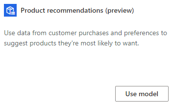
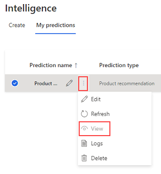
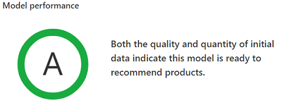
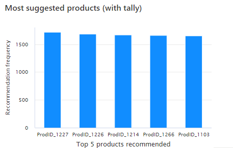
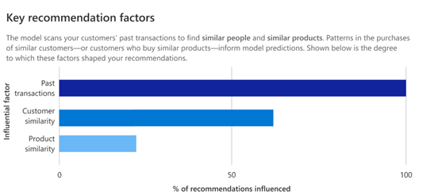
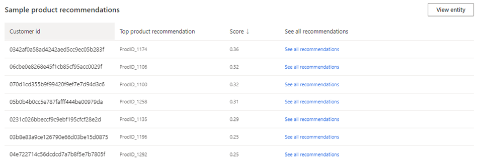

# Product recommendation prediction

The product recommendation model creates sets of predictive product recommendations. Recommendations are based on previous purchase behavior and customers with similar purchase patterns. You can create new product recommendation predictions on the **Intelligence** > **Predictions** page. Select **My predictions** to see other predictions that you've created.

Product recommendations may be subject to local laws and regulations and customer expectations, which the model is not built to specifically take into account.  As a user of this predictive capability, **you must review the recommendations prior to delivering them to your customers** to ensure you are complying with any applicable laws or regulations, and customer expectations for what you may recommend.

Additionally, the output of this model will give you recommendations based on the product ID. Your delivery mechanism will need to map the predicted product IDs to appropriate content for your customers to account for localization, image content, and other business-specific content or behavior.

## Sample Guide

If you're interested in trying this feature but don't have data to complete the requirements below, you can [create a sample implementation](sample-guide-predict-product-recommendation.md).

## Prerequisites

- At least [Contributor permissions](permissions.md) in Customer Insights.

- Business knowledge to understand different types of products for your business and how your customers interact with them. We support recommending products that have been previously purchased by your customers or recommendations for new products.

- You environment has to be configured for the **individual consumers** primary target audience.

- Data about transactions, purchases, and their history:
  - Transaction identifiers to distinguish purchases or transactions.
  - Customer identifiers to map transactions to your customers.
  - Transaction event dates that specify dates the transaction occurred on.
  - Product ID information for the transaction.
  - (Optional) A product catalog data entity to use a product filter.
  - (Optional) If a transaction is a return or not.
  - The semantic data schema requires the following information:
    - **Transaction ID:** A unique identifier of a purchase or transaction.
    - **Transaction date:** The date of the purchase or transaction.
    - **Value of the transaction:** The numerical value of the purchase or transaction.
    - **Unique product ID:** The ID of the product or service purchased if your data is at a line item level.
    - (Optional) **Purchase or return:** A boolean field where the value *true* identifies that a transaction was a return. If the Purchase or Return data is not provided the model and the **Value of the transaction** is negative, we will also use this information to infer a return.
- Suggested data characteristics:
  - Sufficient historical data: At least one year of transactional data, preferably two to three years to include some seasonality.
  - Multiple purchases per customer: Three or more transactions per Customer ID
  - Number of customers: At least 100 customers, preferably more than 10,000 customers. The model will fail with fewer than 100 customers.

> [!NOTE]
>
> - The model requires the transaction history of your customers. The definition of a transaction is quite flexible. Any data that describes a user-product interaction can work as an input. For example, purchasing a product, taking a class, or attending an event.
> - Only one transaction history entity can be configured currently. If there are multiple purchase entities, union them in Power Query before data ingestion.
> - If order and order details are different entities, join them before using in the model. The model doesn't work with only an order ID or receipt ID in an entity.

## Create a product recommendation prediction

1. In Customer Insights, go to **Intelligence** > **Predictions**.

1. Select the **Product recommendations model** tile and select **Use this model**.
   > [!div class="mx-imgBorder"]
   > 

1. Review the information about the model requirements. If you have the required data, select **Get started**.

### Name model

1. Provide a name for the model to distinguish it from other models.

1. Enter a name for the output entity using letters and numbers only, without any spaces. That's the name that the model entity will use. Then, select **Next**.

### Define product recommendation configuration

1. Set the **Number of products** you want to recommend to a customer. This value depends on how your delivery method fills data. If you can recommend three products, set this value accordingly.

   >[!TIP]
   > You can select **Save draft** at any time to save the prediction as a draft. You'll find the draft prediction in the **My predictions** tab.

1. Choose if you want to include products customers have recently purchased in the **Repeat purchases expected** field.

1. Set the **Look back window**. This setting specifies the time frame the model considers before recommending the product to the user again. For example, indicate a customer purchases a laptop every two years. This window will look at the purchase history for the last two years, and if they find an item, the item will be filtered from the recommendations.

1. Select **Next**

### Add required data

1. Select **Add data** and choose the activity type in the side pane that contains the required transaction or purchase history information.

1. Under **Choose the activities**, choose the specific activities from the selected activity you'd like the calculation to focus on.

   :::image type="content" source="media/product-recommendation-select-semantic-activity.PNG" alt-text="Side pane showing choosing specific activities under the semantic type.":::

1. If you haven't mapped the activity to a semantic type yet, select **Edit** to do so. The guided experience to map semantic activities opens. Map your data to the corresponding fields in the selected activity type.

   :::image type="content" source="media/product-recommendation-set-activity-type.PNG" alt-text="Page setting activity type.":::

1. After mapping the activity to the corresponding semantic type, select **Next** to proceed.

1. Map the semantic attributes to the fields that are required to run the model.

1. Select **Save**.

1. Select **Next**.

### Configure product filters

Sometimes, only certain products are beneficial or appropriate for the type of prediction you build. Product filters let you identify a subset of products with specific characteristics to recommend to your customers. The model will use all the products available to learn patterns but only use the products matching the product filter in its output.

1. In the **Add product information** step, add your product catalog with information for each product. Map the information required in select **Next**.

1. In the **Product filters** step, choose between the following options.

   - **No filters**: Use all products in the product recommendation prediction.

   - **Define specific product filters**: Use specific products in the product recommendation prediction.

1. Select **Next**.

1. If you choose to define a product filter, you need to define it now. In the **Product catalog attributes** pane, select the attributes from your *Product Catalog entity* that you want include in the filter.

   :::image type="content" source="media/product-filters-sidepane.png" alt-text="Side pane showing attributed in the product catalog entity to select for product filters.":::

1. Choose if you want the product filter to use **and** or** connectors to logically combine your selection of attributes from product catalog.

   :::image type="content" source="media/product-filters-sample.png" alt-text="Sample configuration of product filters combined with logical AND connectors.":::

1. Select **Next**.

### Set update schedule and review configuration

1. Set a frequency to retrain your model. This setting is important to update the accuracy of predictions as new data is imported into Customer Insights. Most businesses can retrain once per month and get a good accuracy for their prediction.

1. Select **Next**.

1. Review the configuration. You can go back to any part of the prediction configuration by selecting **Edit** under the shown value. Or you can select a configuration step from the progress indicator.

1. If all values are configured correctly, select **Save and run** to begin the prediction process. On the **My predictions** tab, you can see the status of your predictions. The process may take several hours to complete depending on the amount of data used in the prediction.

## Review a prediction status and results

1. Go to the **My predictions** tab on **Intelligence** > **Predictions**.
   > [!div class="mx-imgBorder"]
   > 

1. Select the prediction you want to review.
   - **Prediction name:** The name of the prediction provided when creating it.
   - **Prediction type:** The type of model used for the prediction
   - **Output entity:** Name of the entity to store the output of the prediction. You can find an entity with this name on **Data** > **Entities**.
      *Score* in the output entity is a quantitative measure of the recommendation. The model recommends products with a higher score over products with a lower score.
   - **Predicted field:** This field is populated only for some types of predictions, and isn't used in Product Recommendation prediction.
   - **Status:** The current status of the prediction's run.
        - **Queued:** The prediction is currently waiting for other processes to run.
        - **Refreshing:** The prediction is currently running the "score" stage of processing to produce results that will flow into the output entity.
        - **Failed:** the prediction has failed. Select **Logs** for more details.
        - **Succeeded:** the prediction has succeeded. Select **View** under the vertical ellipses to review the prediction
   - **Edited:** The date the configuration for the prediction was changed.
   - **Last refreshed:** The date the prediction refreshed results in the output entity.

1. Select the vertical ellipses next to the prediction you want to review results for and select **View**.
   > [!div class="mx-imgBorder"]
   > 

1. There are five primary sections of data within the results page:
    1. **Training model performance:** A, B, or C are possible scores. This score indicates the performance of the prediction, and can help you make the decision to use the results stored in the output entity.
        - Scores are determined based on the following rules:
            - **A** The model will be considered **A** quality if the "Success @ K" metric is at least 10% more the baseline. 
            - **B** The model will be considered **B** quality if the "Success @ K" metric is 0% to 10% more than the baseline.
            - **C** The model will be considered **C** quality if the "Success @ K" metric is less than the baseline.

               > [!div class="mx-imgBorder"]
               > 
            - **Baseline**: The model takes the top most recommended products by purchase count across all customers, and uses learned rules identified by the model to create a set of recommendations for the customers. The predictions are then compared to the top products, as calculated by the number of customers that had purchased the product. If a customer has at least one product in their recommended products that was also seen in the top purchased products, they're considered a part of the baseline. If there were 10 of these customers that had a recommended product purchased out of 100 total customers, the baseline would be 10%.
            - **Success @ K**: Using a validation set of time period of transactions, recommendations are created for all customers and compared against the validation set of transactions. For example, in a 12-month period, month 12 might be set aside as a validation set of data. If the model predicts at least one thing you would purchase in month 12 based on what it learned from the previous 11 months, the customer would increase the "Success @ K" metric.

    1. **Most suggested products (with tally):** The top five products that were predicted for your customers.
       > [!div class="mx-imgBorder"]
       > 

    1. **Key recommendation factors:** The model uses the customers' transaction history to make product recommendations. It learns patterns based on past purchases and finds similarities between customers and products. These similarities are then utilized to generate product recommendations.
    The following are the factors that could influence a product recommendation generated by the model.
        - **Past transactions**: Purchase patterns in the past were utilized by the model to generate product recommendations. For example, the model can recommend a *Surface Arc Mouse* if someone recently purchased a *Surface Book 3* and a *Surface Pen*. The model learned that historically, many customers had purchased a *Surface Arc Mouse* after purchasing a *Surface Book 3* and a *Surface Pen*.
        - **Customer similarity**: A recommended product was historically purchased by other customers who show similar purchase patterns. For example, John was recommended *Surface Headphones 2* because Jennifer and Brad recently purchased *Surface Headphones 2*. The model believes John is similar to Jennifer and Brad because they have historically had similar purchase patterns.
        - **Product similarity**: A recommended product is similar to other products that the customer had previously purchased. The model considers two products to be similar if they were bought together or by similar customers. For example, someone gets a recommendation for a *USB Storage Drive* because they previously purchased a *USB-C to USB Adapter* and the model believes that *USB Storage Drive* is similar to *USB-C to USB Adapter* based on historical purchase patterns.

        Every product recommendation is influenced by one or more of these factors. The percentage of recommendations where each influencing factor played a role is visualized in a chart. In the following example, 100% of the recommendations were influenced by past transactions, 60% by customer similarity and 22% by product similarity. Hover over the bars in the chart to see the exact percentage where the influencing factors contributed.

        > [!div class="mx-imgBorder"]
        > 

   1. **Data statistics**: Gives an overview of the number of transactions, customers, and products the model considered. It's based on the input data that was used to learn patterns and generate product recommendations.

      > [!div class="mx-imgBorder"]
      > 

      This section shows stats around the data points that were used by the model to learn patterns and generate product recommendations. Filtering, as configured in the model configuration, will apply on the output generated by the model. However, the model uses all available data to learn patterns. Therefore, if you use product filtering in the model configuration, this section will show the total number of products that the model analyzed to learn patterns, which might differ from the number of products that match the defined filtering criteria.

   1. **High-confidence product recommendations:** A sample of recommendations provided to your customers that the model believes are likely to be purchased by the customer.    
      If a product catalog is added, the product IDs get replaced with product names. Product names provide a more actionable and intuitive information about the predictions.
       > [!div class="mx-imgBorder"]
       > 

## Manage predictions

It's possible to optimize, troubleshoot, refresh, or delete predictions. Review an input data usability report to find out how to make a prediction faster and more reliable. For more information, see [Manage predictions](predictions-overview.md#manage-existing-predictions).

[!INCLUDE [footer-include](includes/footer-banner.md)]
