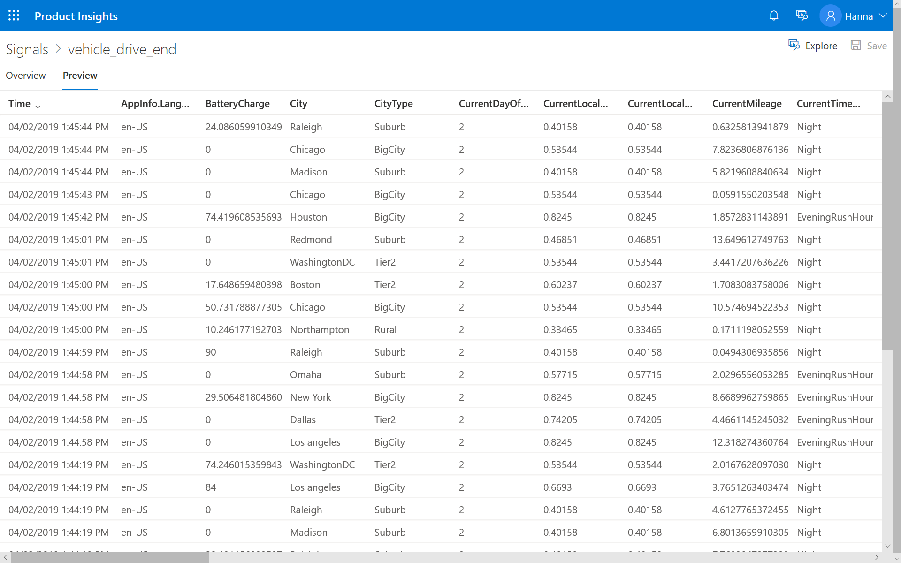
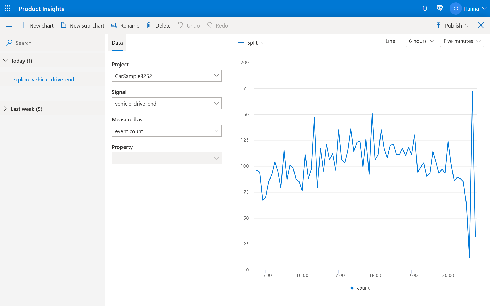

# Locate, view, and explore signals 

A signal is a continuous flow of data. If your team is using Product Insights, you are likely to find signals for your team's projects. 

In this section, you will learn to find signals, examine the contents of a signal, then learn to interact with the signal to get insights. We will be working with sample data for Fabrikam Tech automobile company. 

1. Log into [Product Insights](pi.dynamics.com) to get started.

2. This is your landing page. Select Fabrikam Automobiles project. 

3. Select Signals. You will see a list of all signals being sent for this project. 

4. Select vehicle_drive_end. You can see what information this signal is sending. You should also see the volume of signals coming in. 

5. Select the Preview tab at the top. You can see actual values of signals. For example, you can see the city where the vehicle sending this signal is located. 

6. Click 'Explore' on the top right corner of the screen. You can explore your signal further in this visualization editor. 

> [!div class="nextstepaction"]
> [Next >>](1_1_find.md)
