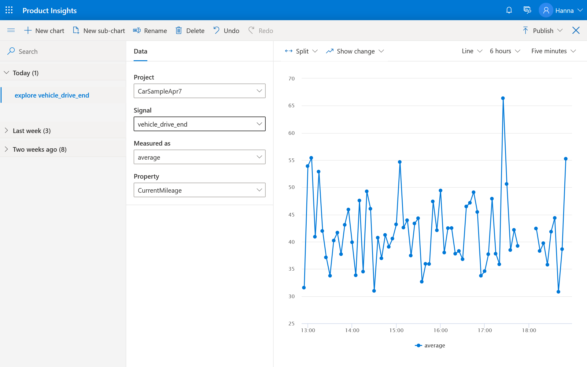

# Create your own metric  

The following steps will find the average MPGe* for each fuel type and city type. These instructions follow from the end of the previous section, [Explore signals](xref:developers/quick-starts/1_3_explore). 

1. On the **Signals** details page, open the chart editor by selecting **Explore** at the top right corner of the screen. 
2. Under **Signal**, select **vehicle_drive_end**.
3. Under **Measured as**, select **average**.
4. Under **Property**, select **CurrentMileage**. This is what the vehicles reported as their MPGe for each trip. After these steps, you will see the chart showing average MPGe for all vehicles and all trips.

5. To see MPGe values for different vehicle fuel types, such as electric or gasoline, select **Split** from the top left corner of the chart. 
6. Under **Split by**, select **CityType**. 

7. Now you will see multiple lines representing average MPGe for each city type. Select **Save** to save the result as a metric.

8. Select **Publish** at the top right corner of the chart to publish the metric. That means this metric (MPGe per city type) will appear on the list of metrics and be available to other users. Your colleagues can then comment on the metric and create their own metrics and charts based on your metric. 

*MPGe: miles per gallon gasoline equivalent

> [!div class="nextstepaction"]
> [Next >>](2_1_define-measure.md)
